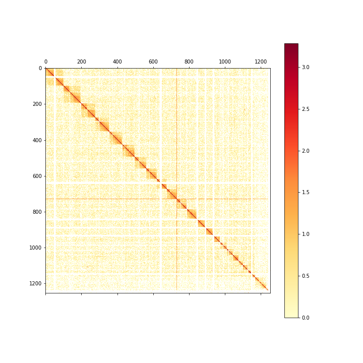
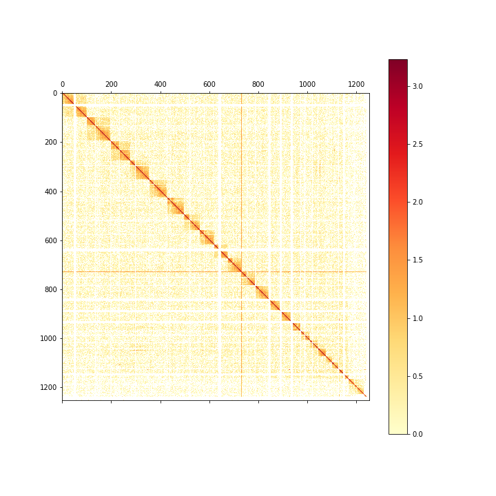
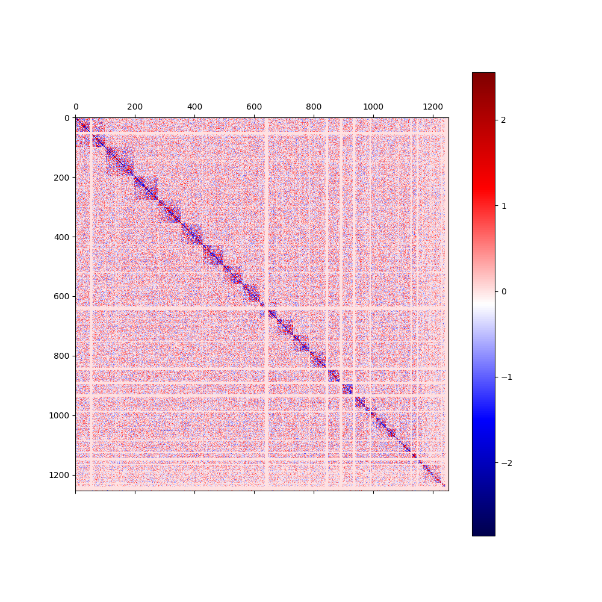

# **this script is to get the subtraction of two hic matrix**
> **the input files should be of .cool format with a certain resolution**

## rely：
> [cooler](https://cooler.readthedocs.io/en/latest/index.html)
## usage：

```
python hic_Subtraction.py file1.cool file2.cool -O outdir -fig outfig

Options:
    -s              default=0               comparasion start bin area
    -e              default=None            comparasion end bin area
    -O, --outdir    default="./"            path to output file.
    -fig, --outfig  default="test.png"      name of output figure
```

## example:
```
python hic_Subtraction.py example/6_2500000.cool example/7_2500000.cool -fig 2500000.png

```
## example_result：
> origin figure  with resolution of 2500000 （species：human）
> file1


> file2


> file1-file2 substraction result from bin 0 to 2000 with different color style
> with blue plots means file1's intensity is lower than file2, and hot color ones means in contrast

